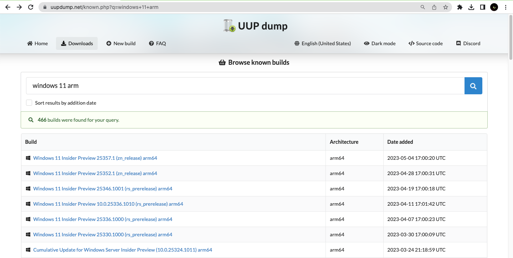
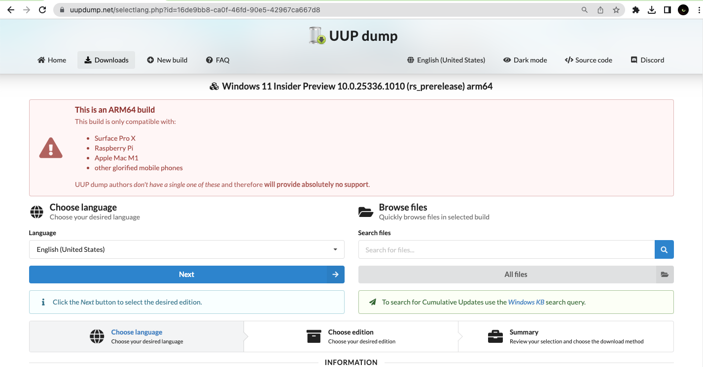
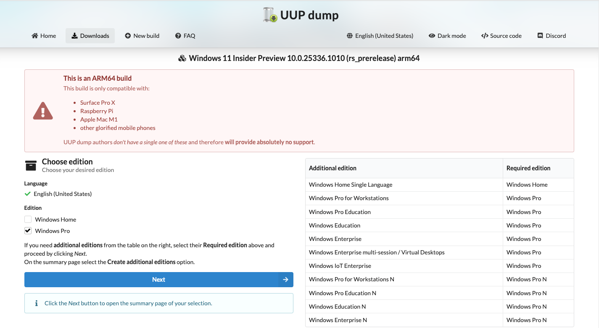
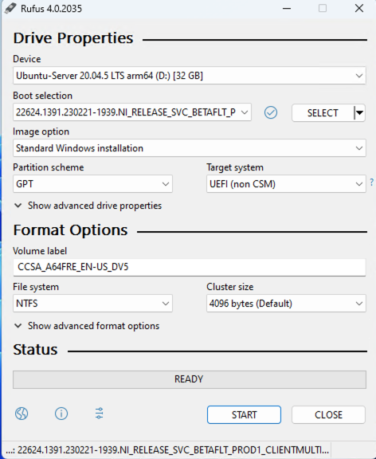
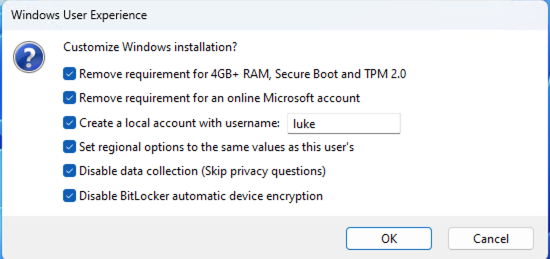

# Windows-11-On-Ampere

## Summary

This repo contains scripts and documents to assist in the installation of Windows on Ampere Platforms. It also contain applications that currently supported on this platform and how to develop applications natively on Ampere for ARM64. 

## Table of Contents
* [Introduction](#introduction)
* [Requirements](#requirements)
  * [Hardware](#hardware)
  * [Operating System](#operating-system)
* [Hardware](#hardware-environment) 
  * [Monitors connected to builtin VGA](#monitors-connected-to-builtin-vga)
* [Install Windows 11 via ISO](#install-windows-via-iso)
  * [Create UUP Dump File for Windows 11](#create-uup-dump-file-for-windows-11)
  * [Building Windows 11 ISO on Ampere Platform](#build-windows-11-iso-on-ampere-platform)
  * [Create Bootable USB for Windows 11 with Rufus](#create-bootable-usb-for-windows-11-with-rufus)
  * [Install Windows on Ampere Workstation](#install-windows-on-ampere-workstation)
* [Applications](#applications)
* [Application Development](#applictation-development)
* [References](#references)

## Introduction
Currently Arm based client devices like Microsoft Surface Pro 9, Lenovo ThinkPad X13s, etc., are all based on Arm SOC like Snapdragon. These devices are good for portable or mobile scenario like pads or laptops running low demanding applications. The SOCs include CPU and other components and are well supported by VHDX images, which is available on Microsoft inside preview program. 

On Ampere CPU based Arm workstations, on the other hand, there is a dedicated Arm based CPU without other components. Installation of these system should follow normal ISO approaches used on installing Windows 11 on PCs, although VHDX could work too with extra driver components not needed. 

As of the time of this preparing this documents, there are no updated Windows 11 ISO available on Windows 11 preview program. But there are other approaches to create Windows 11 installation ISO, which can be used to install Windows 11 on Ampere CPU based workstation normally. 

## Requirements

### Hardware
* An Ampere CPU based workstation to be installed Windows 11
  * AADP[^1]
* An additional client for (1) downloading UUP dump file and (2) creating bootable USB running
  * Windows 11 on ARM, or 
  * Windows 11 on x64.
* An Ubuntu environment for building Windows ISO from UUP dump file, running on
  * Ampere CPU based client, or 
  * WSL running on Windows x64.

### Software 
1. UUP Dump
1. Rufus
1. Windows 11 ARM or X64
1. Ubuntu Arm64/AMD64 on Ampere or x64

## Hardware Environment
AADP A1 has bug on grub and **A2** version is recommended.

### Monitors connected to builtin VGA
One monitor can connect to builtin VGA output is required.

## Install Windows 11 via ISO

### Create UUP Dump File for Windows 11
There are multiple sites can assist on building Windows 11 ISOs. UUP Dump[^2] site is one of them, and document here.

On one of additional client, browse to [https://uupdump.net/known.php?q=windows+11+arm](https://uupdump.net/known.php?q=windows+11+arm), and then follow the steps to create and download a UUP Dump file. 
1. Select the base image on the following page. 

2. Select the language and click `next`. 

3. Select the edition and click `next`. 

4. Select the `Download method` and `Conversion options` and download the zip file


### Build Windows 11 ISO on Ubuntu running on x64 or Ampere CPU

Copy download zip file, saying `22621.1555_arm64_en-us_professional_77b56537_convert.zip`, to a folder, saying home folder. 
Export UUPDUMP_ZIP to the zip file downloaded without the `.zip` extension. For example `UUPDUMP_ZIP=22621.1555_arm64_en-us_professional_77b56537_convert`. Clone this repo to home folder, and then run the following command to build Windows 11 ISO. 

```
cd
UUPDUMP_ZIP=22621.1555_arm64_en-us_professional_77b56537_convert
script/uupdump-build-iso.sh
```

### Create Bootable USB for Windows 11 with Rufus
As the ISO has an secure boot option, this need to be removed. Currently there is only one tool, rufus[^3], has this feature to remove the secure boot. 

**Note**: Bootable USB created with `dd` command can boot into installation UI, but not able to find any installation media. 
If there is an Ampere or other Arm based client running Windows for Arm, download the Arm version, saying [rufus-4.0_arm64.exe](https://github.com/pbatard/rufus/releases/download/v4.0/rufus-4.0_arm64.exe). Otherwise, download x86 or x64 version for non-arm based clients. 

When creating the USB, disable TPM (default). 

1. Click the Select button next to Disk or ISO image > Browse to and select the downloaded Windows 11 iso file

1. Check all check boxes, including `Remove requirement for 4GB+RAM, Secure Boot and TPM2.0` and `Remove required for an online Microsoft account` on `Customize Windows Installation` dialog box. 


### Install Windows on Ampere Workstation

Following the document[^4], boot the system from the USB created above and install Windows 11 as normal. 

Again, if no installation media found after boot into installation UI, the USB need to be recreated with TPM removed. 

### Update VGA Driver 
Download the latest VGA driver and install it. With the latest VGA driver, Windows 11 can support 1920x1080 monitors. 

## Applications
### SSH Server on Windows 11
SSH server can be installed on Windows 11 and enable remote access[^7]. 

Open PowerShell terminal with Administrator and run the following commands.
```
> Get-WindowsCapability -Online | ? Name -like 'OpenSSH*'

Name  : OpenSSH.Client~~~~0.0.1.0
State : Installed

Name  : OpenSSH.Server~~~~0.0.1.0
State : NotPresent

> Add-WindowsCapability -Online -Name OpenSSH.Server~~~~0.0.1.0
> Start-Service sshd
> Get-Service sshd
> Set-Service -Name sshd -StartupType 'Automatic'
```

After that, the port 22 need to be opened from firewall settings. 

### WSL
Not supported yet. 
```
PS> wsl --install
...
Error
```

## Applications Development
WIP[^5]

PCIDRV[^6]

## References
[^1]: https://www.adlinktech.com/Products/Computer_on_Modules/COM-HPC-Server-Carrier-and-Starter-Kit/Ampere_Altra_Developer_Platform

[^2]: https://uupdump.net/known.php?q=windows+11+arm

[^3]: https://rufus.ie/de/

[^4]: https://www.ipi.wiki/pages/comhpc-docs?page=index.html

[^5]: https://learn.microsoft.com/en-us/windows/arm/dev-kit/
[^6]: https://learn.microsoft.com/en-us/samples/microsoft/windows-driver-samples/pcidrv---wdf-driver-for-pci-device/
[^9]: Cmake for windows arm64
[^10]: Python 3.11 for Windows ARM
TortoiseSVN
Git
[^7]: https://www.hanselman.com/blog/how-to-ssh-into-a-windows-10-machine-from-linux-or-windows-or-anywhere